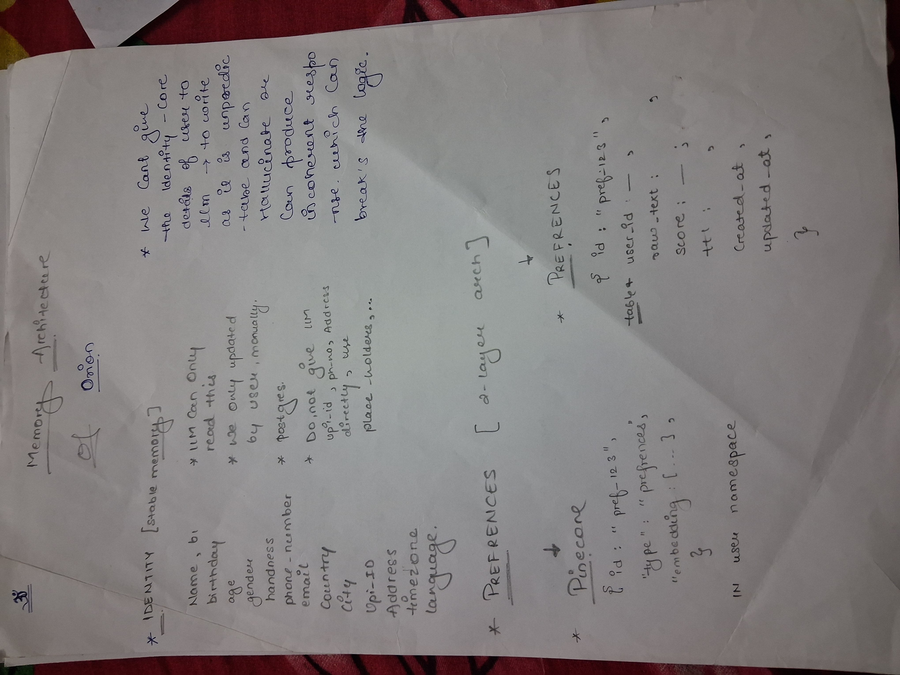
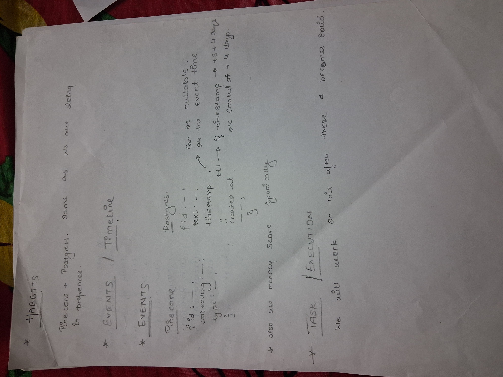
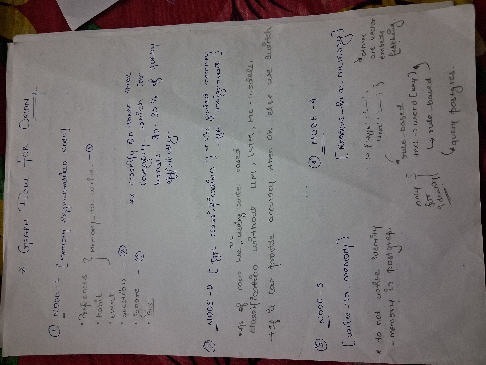
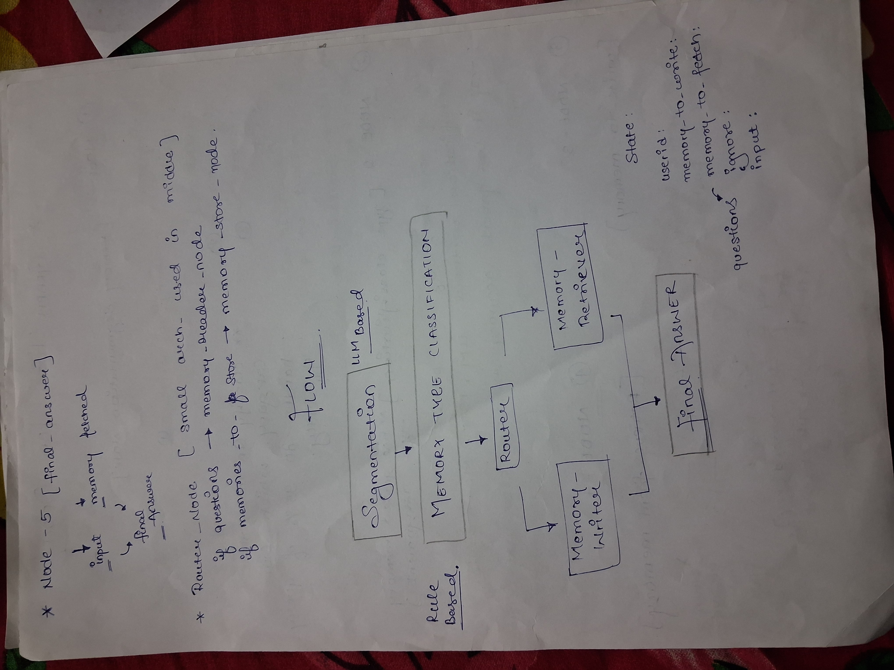

# Orion: Development Journey

## Why Orion Exists

``` Orion is a proactive AI assistant focused on long-term personalization. ``` The goal is not faster answers, but better decisions over time—by understanding user identity, habits, preferences, and events in a durable, structured way.

Most assistants are reactive—responding on demand and forgetting afterward. Orion treats conversations as memory, enabling it to act proactively by initiating interactions and surfacing insights based on learned patterns, not prompts.

### Main focus areas:
- Memory foundation — Extracting meaningful information from conversations and storing/retrieving it efficiently in a structured form.
- Proactive intelligence — Building a proactive brain that uses this memory to drive autonomous, context-aware behavior.

### Development Journey 
> The first two phases failed, but they led to a stable base architecture that we are now evolving.

* ##### ```Phase 1``` Prompt-Centric Experimentation

```The first iteration relied heavily on LLMs for everything:```  reasoning, memory handling, recall, and response generation. Memory tools were exposed directly to the model.

 #### Outcome:

- Functional but unstable
- Excessive tool calls per request
- High token usage
- Non-deterministic behavior

Key Learning: ```LLMs are powerful at reasoning, but unreliable as system controllers or memory managers.```

* ##### ```Phase 2``` — Layered Orchestration

```The system was restructured into multiple logical stages, each with a single responsibility.``` Memory writing and retrieval were separated from response generation.

#### Improvements:

- Better memory consistency
- Clearer execution flow
- Reduced hallucination risk
#### Limitations Discovered:
- Too many LLM-dependent stages , Tokens flew away at an incredible rate
- Latency increased with system complexity
- Architecture was hard to optimize or scale

* ##### ```Phase 3``` — Architecture-First Redesign

```The system was redesigned starting from the memory model rather than the conversation flow.```

#### Focus areas:

- What information should be remembered
- How it should be structured
- When it should be retrieved
- When LLMs are truly necessary
- This shift resulted in a more modular, efficient, and observable system.







